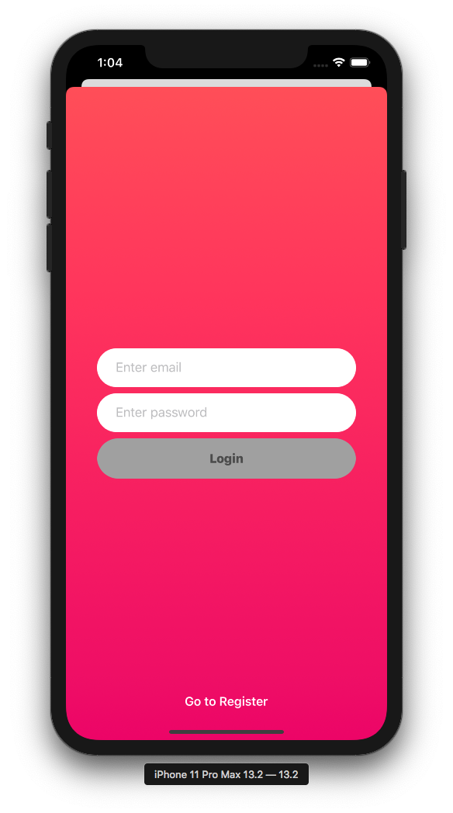
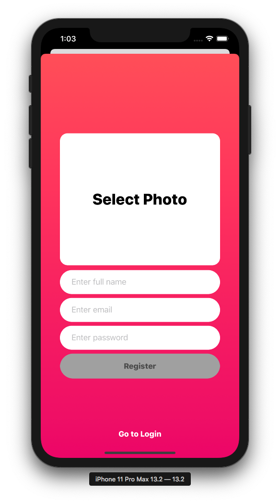
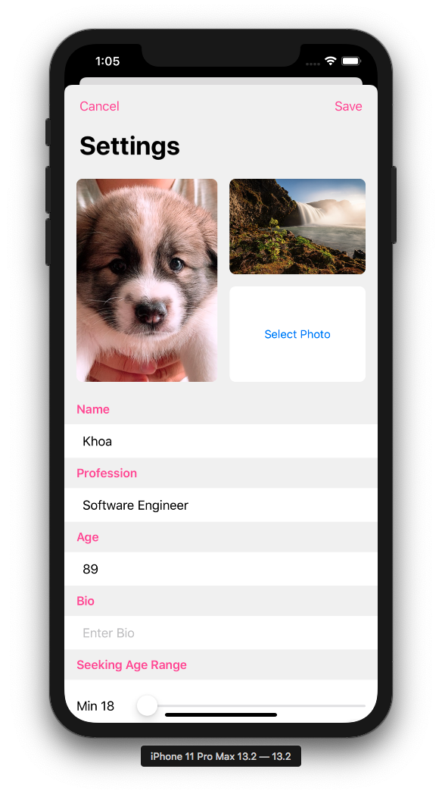
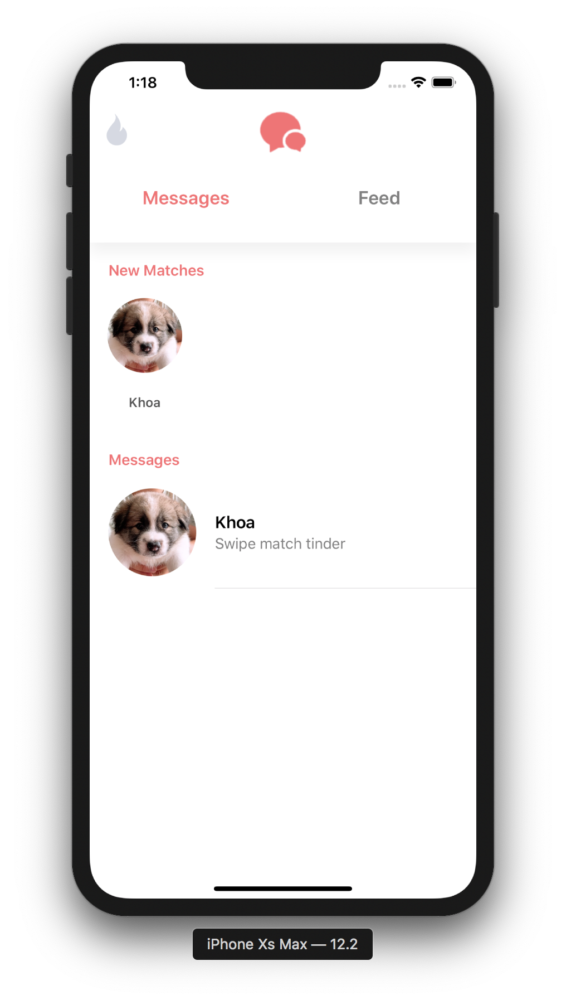
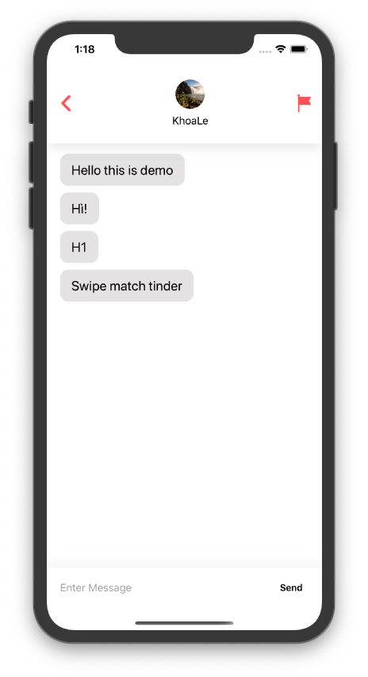

# Swipe Match Tinder
My side project

## Screenshots

## Recording

## Features

- [x] Registration, login.
- [x] Swipe left to dislike, swipe right to like.
- [x] Integrate animations for swiping off screen.
- [x] Send messages.
- [x] Change user informations.
- [ ] Send image messages.
- [ ] Send video messages.

## Usage

1. Download `git clone https://github.com/ldakhoa/SwipeMatchTinder.git`
2. `cd SwipeMatchTinder`
3. Run `pod install`

